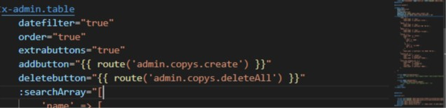
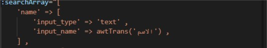
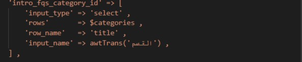
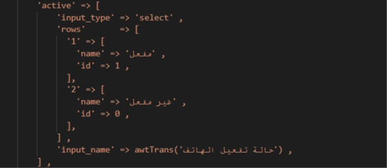

# Project Idea
write here the idea of the project with any language 
# Team dashboard 
dashboard works with InterFace/Repository Design Pattern , read more about design pattern [here](https://asperbrothers.com/blog/implement-repository-pattern-in-laravel)
## Usage 
create empty dataBase , change database data in .env file 
first run commands 

```bash
composer install
```

```bash
php artisan migrate --seed
```

to migrate base tables of dashboard and create new users , roles and permissions to use dashboard 

dahboard info :

email    : aait@info.com

password : 123456

## Usage for create new section in dashboard

```bash
php artisan make:fullsection SectionName arabicSingleName arabicPluralName 
```

## tips 
- SectionName It must be singular, not plural, and begins with the capital letter 
- arabicSingleName The name of the section in Arabic singular
- arabicPluralName The name of the section in Arabic plural
- this command create for you meny files (Controller in Admin Folder , Model in Models folder , DataBase Migrate , Blade Folder in admin folder And Blade File , basic [index - store - update - delete] routes in web.php file for dashboard use )
- you can use ( --seed ) optional with command to create new Seeder for this section 
- you can use ( --request ) optional with command to create new form request file and folder in Request/Admin  for this section 
- you can use ( --resource ) optional with command to create new resource for this section in Resources/Api Folder


## Example
- for create new section for banks in dashboard run command  
```bash 
php artisan make:fullsection Bank بنوك بنك --seed --request --resource 
```
--- command create new files to use 

- new Controller (BankController.php) with  main functions (index - store - update - delete , deleteAll ) 

- new model (Bank.php) with its database migration

- new folder (banks) in resources/Admin folder and new blade files (index , create , update , show , table ) in this folder contains base structer of file you can edit edit it as you need 

- new seeder file (BanksTableSeeder) if you use (--seed) with command 

- new form Request folder (Banks) and request Files (Store , Update ) in Requests/Admin

- new Resource for Api use in Resources/APi if use (--resource)

-  new [show - store - update -delete , delete-all ] routes in web.php to use in dashboard 


## Dashboard components 

read more about laravel 8 components [here](https://laravel.com/docs/8.x/blade#components)

- <x-admin.table> table Contains from some of variables like 

<p align="center" width="100%" height="20px"></p>

- datefilter for show date filter inputs 
- order to show order by filter select input
- extrabuttons for show div of extrabutton to append new inputs to top table extra buttons will append to this slot (<x-slot name="extrabuttonsdiv"> </x-slot>)
- addbutton to show add button to open create page
- delete button to show delete all button 
- searchArray to append search filters inputs as we need , we can add input , select to table top filters . 
- filter input append like : (name is name of input should be same in database , input_type should be text or select , input_name is title of input lable) 

<p align="center" width="50%" height="10px"></p>

- filter select has two type : 

-- first type to filter with passed collection from controller : (rows is collection passed form database to show on select options to select one of them , row_name is the title will show in select options )

<p align="center" width="50%" height="10px"></p>

-- other type to filter with passed array : (rows is  passed array to show on select options to select one of them , row_name is the title will show in select options )


<p align="center" width="50%" height="10px"></p>

- <x-admin.alert> containt dashboard alerts 
- <x-admin.notify-all> containt user notifications models


## Dashboard scripts

- The following file contains a set of functions that facilitate working with graphs (admin/charts_functions.js)

## home page cards 

- all home page cards included in (app/traits/menu) file 

## home page weather widget 

-  You can control the country, colors, size, number of days and type of icons from the following link and copy your code and replace it on the home page [here](https://weatherwidget.io/) 

## notes after publish 
- run this commands in server to improve app speed performance
```bash
php artisan optimize
```
```bash
php artisan config:cache
```
```bash
php artisan route:cache
```

## Notes for working with flutter team :
1. in middleware : "Content-Type" => "application/json",
2. in upload trait : [$allowedMimeTypes add application/octet-stream ] [upload file $path = 'images/'. $directory ;
$file->storeAs($path, $filename);]

## postman publish
https://documenter.getpostman.com/view/8014927/2s9YXb8k2u

## Design Links
- put xd links here 
- 

## Project links
 - site url : 
 - admin url : 
    - email : aait@info.com
    - password : 123456
    
